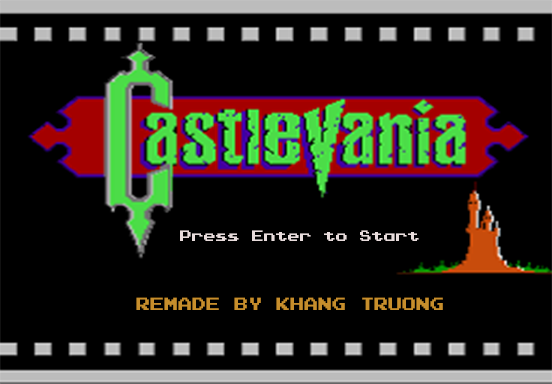
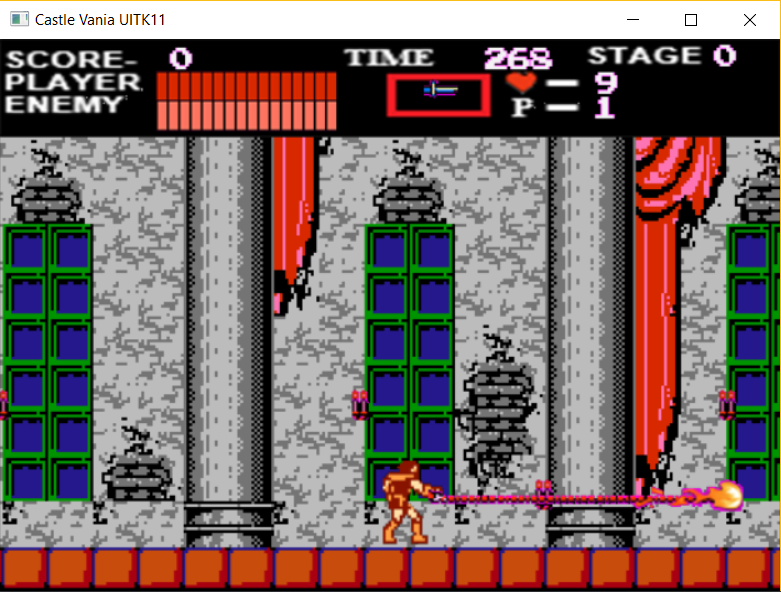
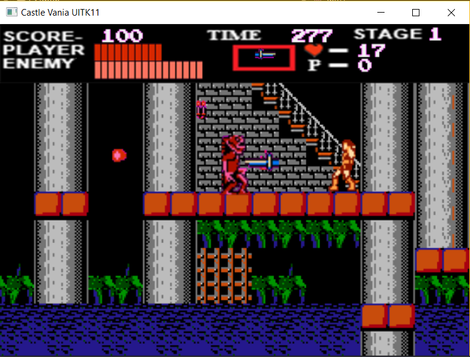
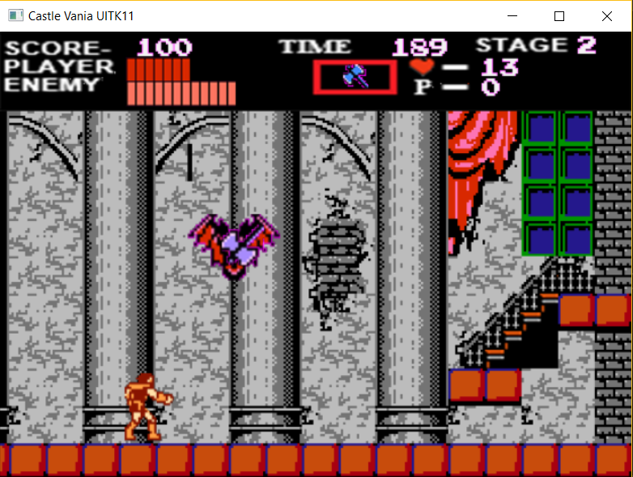

# Castlevania
Game C++ with Direct X Framework	 

Game Original Framework: https://github.com/dungdna2000/gamedev-intro-tutorials

How to Play:
   + Left Arrow : 		    Move left
   + Right Arrow: 		    Move right
   + Up Arrow: 		        Stair up
   + Down Arrow: 		      Stair down
   + Z: 			            Hit
   + X: 			            use Subweapon
   + Space: 			        Jump
   + Number 1-5:		      Set up Subweapon
   
<h2>Game Screenshots </h2>
 
 
 
   (Menu game)
 

  

 
 
 
   (Inside)
 

  
   
   
 
 
 
   (Basement)
 

  
   
   
 
 
 
   (Boss level 1)
 

  

